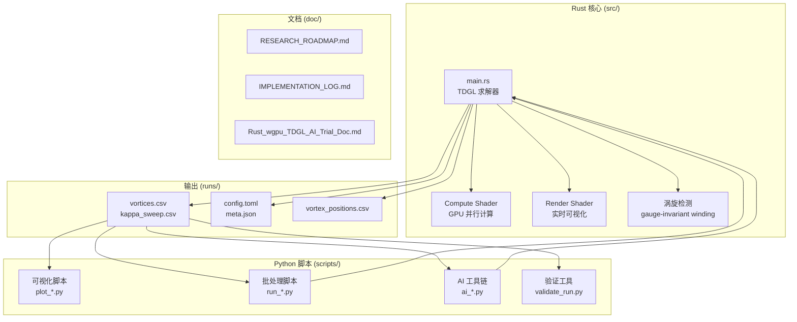

# CLAUDE.md - Rust_wgpu_TDGL_AI_Trial

> 📅 生成时间: 2025-12-25 08:43:44
> 🔄 最后更新: 2025-12-25

## 项目概述

基于 **Rust + wgpu (WebGPU)** 的 GPU 加速二维 **TDGL (Time-Dependent Ginzburg-Landau)** 方程求解器，用于研究超导涡旋与钉扎现象。

### 核心功能

- GPU 并行求解 TDGL 方程（compute shader）
- 实时可视化 |ψ| 热力图
- 空间变化的钉扎势 α(r)
- 涡旋检测与统计（规范不变绕数）
- κ 驱动与 κ sweep（去钉扎曲线）
- AI 工具链：反演 + 闭环 active learning

## 架构总览



## 模块索引

| 模块 | 路径 | 类型 | 说明 |
|------|------|------|------|
| **核心求解器** | `src/main.rs` | Rust Binary | TDGL 方程求解、涡旋检测、可视化 |
| **Python 脚本** | `scripts/` | Python | 后处理、批处理、AI 工具链 |
| **文档** | `doc/` | Markdown | 研究路线图、实施日志 |

## 快速开始

```bash
# 交互式可视化
cargo run -- --flux-n 209

# Headless 批处理
cargo run -- --headless --steps 20000 --sample-period 100 --flux-n 209

# κ sweep (depinning 曲线)
cargo run -- --headless --flux-n 209 --kappa-start 0.0 --kappa-end 0.05 --kappa-step 0.01

# 查看帮助
cargo run -- --help
```

## 关键文件说明

### 源代码

| 文件 | 行数 | 说明 |
|------|------|------|
| `src/main.rs` | ~3250 | 主程序：TDGL 求解器、涡旋检测、可视化渲染 |

### 核心数据结构

```rust
// 复数序参量
struct Complex { re: f32, im: f32 }

// 模拟参数
struct Params {
    nx: u32, ny: u32,      // 网格尺寸
    dt: f32, dx: f32,      // 时间/空间步长
    phi: f32,              // plaquette flux
    kappa: f32,            // 驱动参数
}

// 运行配置
struct RunConfig {
    flux_n: i32,           // 磁通量子数
    defect_mode: DefectMode,  // random | lattice
    defect_count: usize,   // 缺陷数量
    // ...
}

// 运行模式
enum RunMode {
    Interactive,           // 交互式可视化
    Bench,                 // 性能基准测试
    Headless { steps, sample_period },  // 无头批处理
    HeadlessKappaSweep { ... },         // κ 扫参
}
```

### Python 脚本

| 脚本 | 功能 |
|------|------|
| `plot_vortices.py` | 绘制 vortices.csv 时间序列 |
| `plot_kappa_sweep.py` | 绘制 depinning 曲线，提取 κ_c |
| `run_depinning_phase_diagram.py` | 自动扫参生成相图 |
| `plot_phase_diagram.py` | 绘制相图热图 |
| `ai_inverse_design.py` | AI 反演/逆向设计 (baseline) |
| `ai_closed_loop.py` | AI 闭环 active learning |
| `run_matching_field_scan.py` | matching field 扫描 |
| `plot_structure_factor.py` | 结构因子 S(k) 计算 |
| `validate_run.py` | 运行输出验证 |

## 物理模型

### TDGL 方程

```
∂ψ/∂t = (∇ - iA)² ψ + α(r)ψ - |ψ|² ψ
```

- **ψ**: 复数序参量（超导序参）
- **A**: 矢势（Landau gauge: A = (0, Bx, 0)）
- **α(r)**: 材料参数场（缺陷处 α < 0）
- **边界条件**: 磁周期边界（torus 上均匀磁场自洽）

### 磁通量子化

```
φ = 2πn / (Nx × Ny)
B = φ / dx²
```

## 输出文件格式

### vortices.csv

```csv
step,time,kappa,vortices,antivortices,net,energy,energy_density,pinned_v,pinned_av,pinned_net,mean_vx,mean_vy,mean_speed
```

### kappa_sweep.csv

```csv
kappa,samples,mean_speed,mean_vx,mean_vy,net_mean,pinned_net_mean,energy_density_mean
```

### config.toml

每次运行的完整参数配置，便于复现实验。

## 依赖

### Rust

```toml
wgpu = "23"
winit = "0.30"
pollster = "0.4"
bytemuck = { version = "1", features = ["derive"] }
rand = "0.8"
env_logger = "0.11"
log = "0.4"
```

### Python

```
numpy
pandas
matplotlib
scikit-learn
scipy
```

## 开发规范

### 代码风格

- Rust: 遵循 rustfmt 默认配置
- Python: 脚本保持"离线可跑"，最小依赖

### 注释语言

- 代码注释: 中英混合（保持与现有代码一致）
- 文档: 中文为主

### 测试

- 当前缺少单元测试
- 使用 `scripts/validate_run.py` 进行输出验证

## 研究工作流

```
1. 仿真 (Rust/wgpu)
   ↓
2. 标准化输出 (config.toml, vortices.csv, ...)
   ↓
3. 后处理 (Python 脚本)
   ↓
4. AI 闭环 (active learning)
   ↓
5. 回到步骤 1
```

## 性能参考

RTX 4060 Laptop GPU:

| 网格规模 | steps/s | cells/s |
|----------|---------|---------|
| 128² | 29,833 | 4.89e8 |
| 256² | 28,410 | 1.86e9 |
| 512² | 22,310 | 5.85e9 |
| 1024² | 13,329 | 1.40e10 |

## 相关文档

- [README.md](README.md) - 项目说明
- [REPORT.md](REPORT.md) - 课程期末作业论文
- [doc/RESEARCH_ROADMAP.md](doc/RESEARCH_ROADMAP.md) - 研究路线图
- [doc/IMPLEMENTATION_LOG.md](doc/IMPLEMENTATION_LOG.md) - 实施日志

---

*此文件由 Claude Code 自动生成，用于提供 AI 编程助手上下文。*
