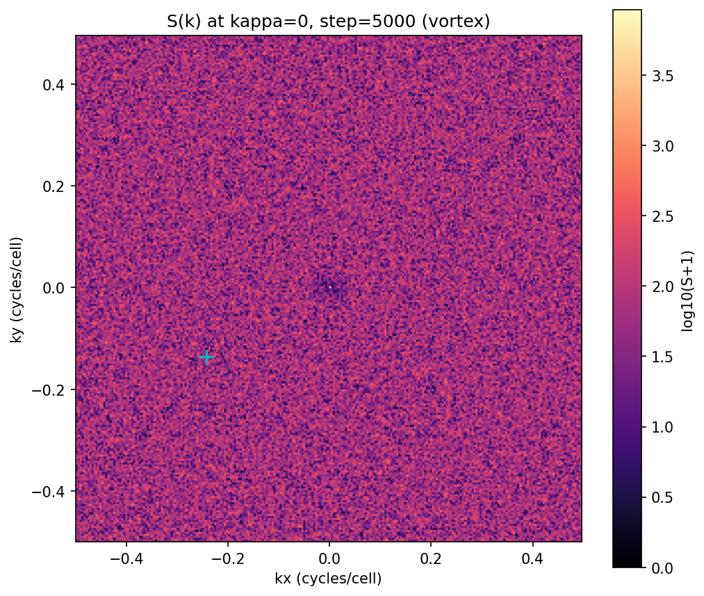
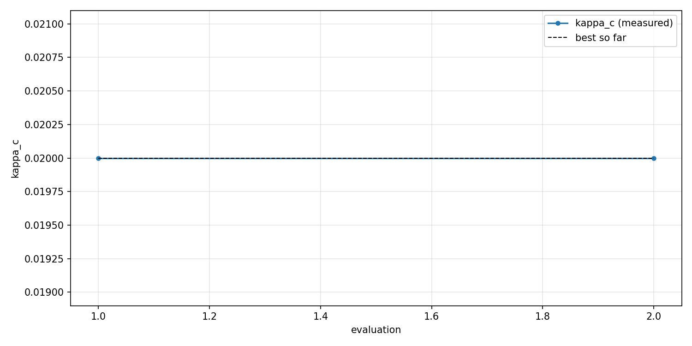
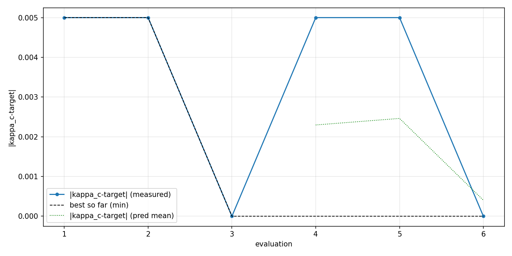
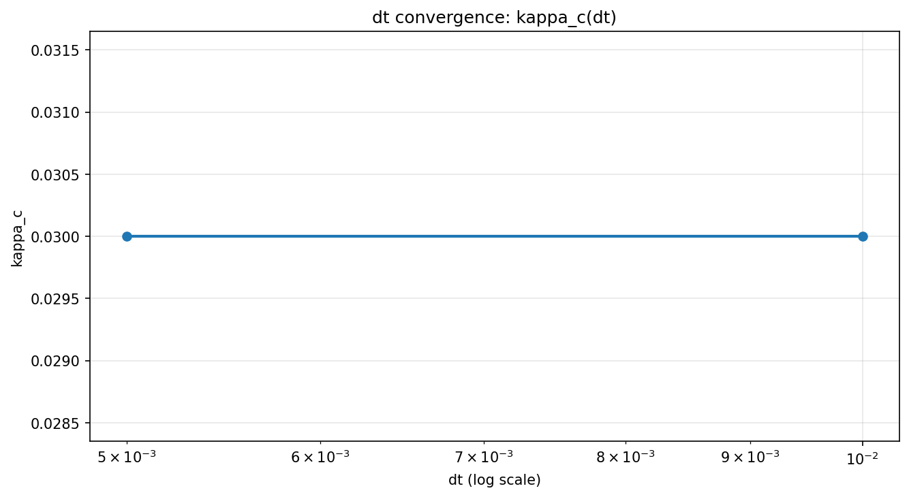
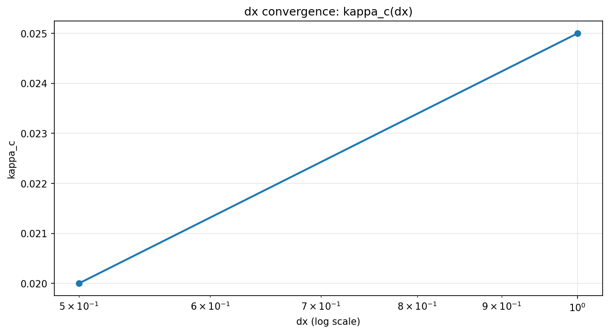
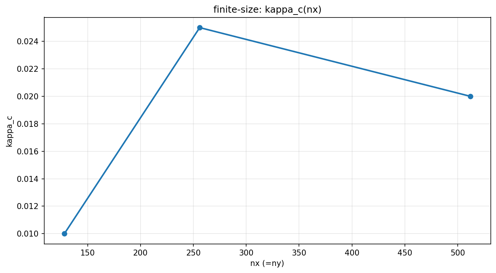

<!--
ASCII-only header (keep this block) to avoid a Windows apply_patch UTF-8 slicing bug.
File encoding: UTF-8.
Last updated: 2025-12-18.
Synced with: phi/flux-n, magnetic periodic BC, gauge-invariant vortex winding, energy output, drive kappa+sweep, kappa initial relax, pinned/velocity observables, out-dir, optional vortex position dump, phase diagram scripts, matching field/S(k) scripts, AI inversion baseline, AI closed loop runner.
Doc note: updated CLI usage + CSV columns + vortex detection notes (+ pinned/velocity columns).
Doc note: add --seed and write CSV metadata as # comments (+ kappa).
Doc note: kappa sweep writes kappa_sweep.csv (+ plot script).
Doc note: kappa_c extraction + automated phase diagram + AI inversion (scripts/ai_inverse_design.py).
Doc note: AI closed loop runner (scripts/ai_closed_loop.py) for surrogate+simulation feedback.
Doc note: matching field scan scripts (scripts/run_matching_field_scan.py + scripts/plot_matching_field.py).
Doc note: structure factor script (scripts/plot_structure_factor.py) based on vortex_positions.csv.
Doc note: report refreshed with end-to-end workflow summary (phase diagram, matching field, S(k), AI loop).
Doc note: quick visual checks can be generated under runs/*_smoke (optional).
Doc note: plot_vortices.py supports --no-show (batch) and optional --kappa selection.
Doc note: convergence+finite-size scripts: scripts/run_convergence_study.py + scripts/plot_convergence_study.py; run validation: scripts/validate_run.py; refined outputs: runs/convergence_dx_flux64_refined, runs/finite_size_refined.
Doc note: added literature refs for matching-field / periodic pinning arrays (DOIs via Crossref).
Doc note: added AI target inversion demo (runs/ai_inversion_target_lattice_refined) and inversion accuracy eval (runs/phase_diagram_ai_eval_128).
Doc note: default --out-dir is runs/<mode>_<unix_ms> (pass --out-dir . for legacy cwd output).
Doc note: repo hygiene: LICENSE + requirements.txt + .gitignore (target/, runs/).
Doc note: external comparison uses OpenAlex abstracts for refs [6-9] (accessed 2025-12-18).
Doc note: AI inversion baselines include oracle and random-pick error (computed from runs/phase_diagram_ai_eval_128).
Doc note: image links use ./runs/... for better compatibility with some Markdown-to-doc converters.
Pad: 00000000000000000000000000000000000000000000000000000000000000000000000000000000000000000000000000000000000000000000000000000000000000000000000000000000000000000000000000000000000000000000000000000000
-------------------------------------------------------------------------------
-------------------------------------------------------------------------------
-------------------------------------------------------------------------------
-->

# GPU 加速二维 TDGL 超导涡旋模拟

> **课程**：计算物理
> **学号**：[202332021221]
> **姓名**：[刘凤祥]
> **日期**：2024年12月

---

## 摘要

本项目构建了一个基于 **Rust + wgpu(WebGPU)** 的 GPU TDGL 端到端研究平台，用于研究二维超导涡旋与缺陷钉扎现象。平台把“仿真→输出→后处理→批处理→AI 选点回仿真”的研究工作流落地为可复现工具链：

- **物理一致性**：磁通量量子化（`--flux-n`）+ 磁周期边界（torus 上均匀磁场自洽），涡旋检测使用 **规范不变绕数**（link-based）。
- **可复现实验记录**：每次运行输出到 `--out-dir`（默认 `runs/<mode>_<unix_ms>`），自动写入 `config.toml` 与 `meta.json`，并以 CSV（含 `#` 元信息注释）记录观测量。
- **批处理与相图**：支持 headless κ sweep（`kappa_sweep.csv`），并提供脚本自动提取 κ_c、绘制相图与 matching field 曲线。
- **结构量与创新扩展**：支持输出涡旋位置（`vortex_positions.csv`），并用结构因子 S(k) 定量“有序/无序”；提供 AI 反演（baseline）与 AI 闭环 active learning（自动选点→回填数据集）。

---

## 一、研究目标

### 1.1 项目概述

用 **Rust + wgpu(WebGPU)** 在 GPU 上并行求解二维 **时间依赖 Ginzburg–Landau（TDGL）** 方程，构建可复现的涡旋研究平台，并围绕钉扎/去钉扎与缺陷几何开展参数研究与自动化分析。

### 1.2 研究问题

1. **外场自洽与拓扑一致性**：在 torus 上实现均匀外场并验证净涡旋数与总磁通量子数 `flux_n` 的一致性（规范不变统计）。
2. **去钉扎（depinning）阈值**：通过 κ 驱动与 κ sweep 提取临界 κ_c，并研究其随缺陷强度/密度/几何的变化（相图）。
3. **缺陷几何与 matching field**：对比随机缺陷与周期缺陷阵列，在匹配场条件下观察 κ_c 的增强（commensurability peak）。
4. **结构量定量**：从涡旋位置计算结构因子 S(k)，区分 Abrikosov 晶格/无序态，并与缺陷几何关联。
5. **自动化与 AI 闭环**：将“数据生成→提取→建模→选点→回仿真”闭环落地为脚本工具链，支持离线运行。

### 1.3 交付成果

- 实时可视化（|ψ| 热力图）与 headless 批处理（可生成可复现实验目录）
- κ sweep / κ_c 提取脚本与相图（`phase_diagram.csv` + heatmap）
- matching field 扫描与对比曲线（random vs lattice）
- 结构因子 S(k) 后处理与主峰指标（有序性定量）
- AI 反演（baseline）与 AI 闭环 active learning（自动选点→回填）
- 完整的技术报告与文档（README/REPORT/doc）

---

## 二、物理原理

本节为第一次接触 TDGL 方程的读者提供完整的物理背景。

### 2.1 什么是超导？

超导是一种宏观量子现象，当材料冷却到临界温度 T_c 以下时：
- **零电阻**：电流无损耗流动
- **完全抗磁性**（Meissner 效应）：磁场被排斥出超导体

**核心思想**：
- 超导态由复数序参量 ψ 描述
- |ψ|^2 代表超导电子对密度
- ψ 的相位与超流速度相关

### 2.2 Ginzburg-Landau 理论

GL 理论是描述超导体的唯象理论，自由能泛函为：

$$
F = \int d^3r \left[ \alpha|\psi|^2 + \frac{\beta}{2}|\psi|^4 + \frac{1}{2m^*}|(-i\hbar\nabla - e^*\mathbf{A})\psi|^2 + \frac{B^2}{2\mu_0} \right]
$$

| 符号 | 物理含义 | 说明 |
|:----:|:--------:|:----:|
| ψ | 序参量 | 复数场，|ψ|^2 ∝ 超导电子密度 |
| α | 材料参数 | α < 0 时超导，α > 0 时正常态 |
| β | 非线性系数 | 稳定项，β > 0 |
| A | 矢势 | 磁场 B = ∇×A |
| m*, e* | 有效质量/电荷 | Cooper 对参数 |

### 2.3 时间依赖 GL（TDGL）方程

将 GL 理论推广到动力学，得到 TDGL 方程：

$$
\frac{\partial \psi}{\partial t} = \frac{1}{\tau_{GL}} \left[ -\frac{\delta F}{\delta \psi^*} \right]
$$

简化形式（无量纲化，忽略电流项）：

$$
\frac{\partial \psi}{\partial t} = (\nabla - i\mathbf{A})^2\psi + \alpha(\mathbf{r})\psi - |\psi|^2\psi
$$

**物理意义**：
- **第一项**：扩散 + 磁场耦合（gauge-covariant Laplacian）
- **第二项**：线性增长/衰减（α > 0 超导，α < 0 正常态）
- **第三项**：非线性饱和（限制 |ψ| 的增长）

### 2.4 涡旋（Vortex）

涡旋是超导体中的拓扑缺陷：

| 特征 | 描述 |
|:----:|:----:|
| 核心 | |ψ| = 0（正常态） |
| 相位 | 绕核心一圈变化 ±2π |
| 磁通 | 携带量子化磁通 Φ0 = h/2e |

**涡旋检测**：通过相位绕数（phase winding）识别
- 绕数 = +2π → 涡旋
- 绕数 = -2π → 反涡旋

### 2.5 钉扎（Pinning）

钉扎是指涡旋被材料缺陷"固定"的现象：

| 钉扎类型 | 实现方式 | 物理效果 |
|:--------:|:--------:|:--------:|
| 点缺陷 | 局部 α < 0 | 涡旋核心能量降低 |
| 线缺陷 | 柱状 α < 0 区域 | 涡旋沿线排列 |
| 周期阵列 | 人工纳米图案 | 涡旋晶格匹配 |

**重要性**：钉扎抑制涡旋运动 → 降低耗散 → 提高临界电流

### 2.6 Landau Gauge

为了在数值模拟中引入均匀磁场 B（沿 z 方向），采用 Landau 规范：

$$
\mathbf{A} = (0, Bx, 0)
$$

此时 gauge-covariant 导数变为：
- x 方向：∂_x（无相位因子）
- y 方向：∂_y - iBx（带相位因子）

### 2.7 离散化方案

**5 点 stencil Laplacian**（周期边界）：

$$
\nabla^2\psi \approx \frac{\psi_{i+1,j} + \psi_{i-1,j} + \psi_{i,j+1} + \psi_{i,j-1} - 4\psi_{i,j}}{dx^2}
$$

**Gauge-covariant 版本**（link 变量）：

$$
U_y(i) = e^{-i\varphi i},\quad \varphi \equiv B\,dx^2
$$

$$
\Delta_A\psi = \frac{\psi_{xp} + \psi_{xm} + U_y\psi_{yp} + U_y^*\psi_{ym} - 4\psi}{dx^2}
$$

#### 2.7.1 磁周期边界与磁通量量子化（torus 上均匀磁场自洽）

在二维周期边界（环面 torus）上实现**均匀磁场**时，Landau gauge 的 $A_y=Bx$ 本身不周期。为了让离散系统全局自洽，需要满足：

1) **磁通量量子化（推荐）**  
设每个 plaquette 的无量纲磁通为 $\varphi=B\,dx^2$，则

$$
\varphi N_xN_y = 2\pi n,\quad n\in\mathbb Z
$$

等价于：

$$
\varphi=\frac{2\pi n}{N_xN_y},\quad B=\frac{\varphi}{dx^2}
$$

2) **磁周期边界（magnetic periodic BC）**  
在 link 变量形式下，一个常用构造为：

- $U_y(i)=\exp(-i\varphi i)$  
- $U_x(i,j)=1$（内部）  
- 仅在 $x$ 边界 hop（$i=N_x-1\rightarrow 0$）处：

$$
U_x(N_x-1,j)=\exp(+i\varphi N_x j)
$$

该构造保证每个 plaquette 的 gauge-invariant 磁通一致，并且系统在 torus 拓扑上自洽。  
本项目当前实现使用上述磁周期边界，并将外场以整数磁通 `flux_n`（即 $n$）作为推荐输入方式。

**时间推进**（显式 Euler）：

$$
\psi^{n+1} = \psi^n + dt \cdot F(\psi^n)
$$

**稳定性条件**：dt < dx^2/4

---

## 三、数值方法

### 3.1 GPU 并行策略

| 策略 | 实现 | 优势 |
|:----:|:----:|:----:|
| 空间并行 | 每个 GPU 线程处理一个网格点 | 充分利用 GPU 并行性 |
| Ping-pong buffer | 双缓冲交替读写 | 避免数据竞争 |
| 无 CPU 回读 | Fragment shader 直接采样 | 消除传输瓶颈 |

### 3.2 Workgroup 配置

```
Workgroup size: 8×8 = 64 threads
Grid: 256×256 → 32×32 workgroups
Total threads: 65,536
```

### 3.3 涡旋检测算法

**规范不变绕数（gauge-invariant winding）**：

当 $B\\neq 0$（存在矢势 $\\mathbf A$）时，直接对 $\\theta=\\arg(\\psi)$ 做绕数会依赖 gauge 选择。更稳妥的方式是基于 link 变量计算边相位增量：

$$
\\Delta\\theta_x(i,j)=\\arg\\left(\\psi^*_{i,j}\\,U_x(i,j)\\,\\psi_{i+1,j}\\right),\\quad
\\Delta\\theta_y(i,j)=\\arg\\left(\\psi^*_{i,j}\\,U_y(i)\\,\\psi_{i,j+1}\\right)
$$

再对一个网格元绕一圈求和并 unwrap 到 $(-\\pi,\\pi]$，得到 winding $W\\approx \\pm 2\\pi$ 判定涡旋/反涡旋。

**旧版相位绕数法（仅在 B=0 或不含 A 的简化模型下适用）**：

```
对每个网格单元 (x, y):
    1. 获取四角相位: p00, p10, p11, p01
    2. 计算边相位差（unwrap 到 (-π, π]）
    3. 求和: sum = Δp₁ + Δp₂ + Δp₃ + Δp₄
    4. 判断:
       - sum > 0.75×2π → 涡旋
       - sum < -0.75×2π → 反涡旋
```

### 3.4 采样策略

- 涡旋检测：每 100 步采样一次（避免频繁 GPU→CPU 传输）
- 可视化：每帧 10 步更新

---

## 四、Rust + wgpu 实现

### 4.1 项目结构

```
Rust_wgpu_TDGL_AI_Trial/
├── Cargo.toml
├── README.md
├── REPORT.md                # 本报告
├── LICENSE
├── requirements.txt
├── .gitignore
├── src/
│   └── main.rs              # 主程序（~2800 行）
├── scripts/
│   ├── plot_vortices.py              # 涡旋时间序列曲线
│   ├── plot_kappa_sweep.py           # depinning 曲线（order parameter vs kappa）
│   ├── run_depinning_phase_diagram.py# 扫参/提取 kappa_c -> phase_diagram.csv
│   ├── plot_phase_diagram.py         # phase_diagram.csv 热图
│   ├── ai_inverse_design.py          # AI 反演/逆向设计（baseline）
│   ├── ai_closed_loop.py             # AI 闭环：选点→仿真→回填（active learning）
│   ├── run_matching_field_scan.py    # matching field: scan flux_n (random vs lattice)
│   ├── plot_matching_field.py        # matching_field.csv plot (kappa_c vs flux_n)
│   └── plot_structure_factor.py      # vortex_positions.csv -> 2D structure factor S(k)
├── doc/
│   ├── README.md
│   ├── IMPLEMENTATION_LOG.md
│   ├── RESEARCH_ROADMAP.md
│   └── Rust_wgpu_TDGL_AI_Trial_Doc.md
├── runs/                    # 本地输出目录（默认 --out-dir；.gitignore 忽略）
├── vortices.csv             # legacy：用 --out-dir . 生成（示例/旧行为）
└── vortices_plot.png        # legacy：用 --out-dir . 生成（示例/旧行为）
```

### 4.2 核心数据结构

```rust
/// 模拟参数（GPU uniform buffer）
#[repr(C)]
struct Params {
    nx: u32,        // 网格宽度
    ny: u32,        // 网格高度
    show_alpha: u32,// 显示模式
    _pad0: u32,
    dt: f32,        // 时间步长
    dx: f32,        // 空间步长
    phi: f32,       // plaquette flux: phi = B * dx^2 (quantized on torus)
    kappa: f32,     // drive: phase twist / constant Ay0
}

/// 复数（GPU vec2<f32>）
#[repr(C)]
struct Complex { re: f32, im: f32 }
```

### 4.3 WGSL Compute Shader 核心

```wgsl
// Gauge-covariant TDGL 更新
@compute @workgroup_size(8, 8)
fn main(@builtin(global_invocation_id) gid: vec3<u32>) {
    let psi = psi_in[i];

    // Uy = exp(-i (phi*x + kappa))
    let theta = -(params.phi * f32(gid.x) + params.kappa);
    let Uy = vec2(cos(theta), sin(theta));

    // Gauge-covariant Laplacian
    let psi_yp = cmul(Uy, psi_in[idx(gid.x, yp)]);
    let psi_ym = cmul(conj(Uy), psi_in[idx(gid.x, ym)]);
    let lap = (psi_xp + psi_xm + psi_yp + psi_ym - 4.0*psi) / dx2;

    // TDGL 更新
    let rhs = lap + alpha[i] * psi - psi * |psi|^2;
    psi_out[i] = psi + dt * rhs;
}
```

### 4.4 依赖

```toml
[dependencies]
wgpu = "23"           # WebGPU 实现
winit = "0.30"        # 窗口管理
pollster = "0.4"      # async 运行时
bytemuck = "1"        # 内存布局
rand = "0.8"          # 随机数
env_logger = "0.11"   # 日志
log = "0.4"
```

---

## 五、运行方式

### 5.1 编译

```bash
cargo build --release
```

### 5.2 交互式可视化

```bash
cargo run --release -- --flux-n 209

# 固定随机种子（可复现）
cargo run --release -- --flux-n 209 --seed 1234

# 或指定目标外场（会自动量子化到最近的整数磁通 n）
cargo run --release -- --b 0.02

# 可选：修改 dt/dx
cargo run --release -- --flux-n 209 --dt 0.01 --dx 1.0
```

**交互控制**：
- `A` 键：切换显示 |ψ| / α 场
- 关闭窗口退出

### 5.3 性能基准测试

```bash
cargo run --release -- --bench --flux-n 209
```

### 5.4 Headless 扫参/批处理（无窗口）

```bash
# headless：适合扫参/批处理（默认输出到 runs/headless_<unix_ms>/）
cargo run --release -- --headless --steps 20000 --sample-period 100 --flux-n 209 --seed 1234

# depinning/drive point: add constant twist kappa (Uy <- exp(-i(phi*x + kappa)))
cargo run --release -- --headless --steps 20000 --sample-period 100 --flux-n 209 --kappa 0.02 --out-dir runs/kappa_0.02

# optional: dump vortex positions for structure factor / tracking
cargo run --release -- --headless --steps 20000 --sample-period 100 --flux-n 209 --kappa 0.02 --dump-positions --out-dir runs/kappa_0.02

# kappa sweep (depinning curve), writes kappa_sweep.csv
cargo run --release -- --headless --flux-n 209 --kappa-start 0.0 --kappa-end 0.05 --kappa-step 0.01 --kappa-initial-relax-steps 20000 --kappa-relax-steps 2000 --kappa-measure-steps 5000 --sample-period 100 --out-dir runs/kappa_sweep
```

### 5.5 绘制涡旋曲线

```bash
python scripts/plot_vortices.py runs/kappa_0.02/vortices.csv
python scripts/plot_kappa_sweep.py runs/kappa_sweep/kappa_sweep.csv --order-parameter abs_mean_vx --kappa-c-method baseline_threshold --epsilon 1e-3
```

`vortices.csv` 当前列为：

```
step,time,kappa,vortices,antivortices,net,energy,energy_density,pinned_v,pinned_av,pinned_net,mean_vx,mean_vy,mean_speed
```

Note: with `--dump-positions`, also writes `vortex_positions.csv` (`step,time,kappa,x_cell,y_cell,sign`).
Also writes `kappa_sweep.csv` in sweep mode: `kappa,samples,mean_speed,mean_vx,mean_vy,net_mean,pinned_net_mean,energy_density_mean`.

注：`kappa` 对应 `Uy <- exp(-i(phi*x + kappa))` 的常数相位扭转（等效 `A_y0`），涡旋的洛伦兹漂移方向主要沿 **x**，因此 depinning order parameter 推荐使用 `abs_mean_vx`（而不是 `mean_speed`）。

此外，在 `--out-dir` 中会生成：
- `config.toml`：本次运行的全部参数（便于复现）
- `meta.json`：GPU/后端/argv/时间戳等运行环境信息

文件开头会以 `# ...` 注释行记录本次运行的 nx/ny、dt/dx、flux_n、phi/kappa/B、seed 与缺陷参数（便于复现实验）。

### 5.6 自动化相图（kappa_c heatmap）

```bash
python scripts/run_depinning_phase_diagram.py --flux-n 209 --seed 1234 --order-parameter abs_mean_vx --kappa-c-method baseline_threshold --initial-relax-steps 20000 --out-root runs/phase_diagram --overwrite-summary
python scripts/plot_phase_diagram.py runs/phase_diagram/phase_diagram.csv --no-show
```

### 5.7 AI 反演/逆向设计（baseline）

```bash
python scripts/ai_inverse_design.py train runs/phase_diagram/phase_diagram.csv
python scripts/ai_inverse_design.py invert runs/phase_diagram/phase_diagram.csv --target 0.03 --search-from-data --top 10
```

### 5.7.1 AI 闭环（active learning）

```bash
# 注意：负数列表必须用 '=' 传参（argparse 会把 "-0.2,-0.5" 误判为新的选项）
python scripts/ai_closed_loop.py --build --objective maximize --iters 8 --init-random 4 --out-root runs/ai_closed_loop --flux-n-list=209 --seed-list=1234 --defect-mode-list=random --defect-spacing-list=32 --alpha-defect-list=-0.2,-0.5 --defect-radius-list=3 --defect-count-list=0,20,50,100 --kappa-start 0.0 --kappa-end 0.05 --kappa-step 0.01 --initial-relax-steps 20000 --relax-steps 2000 --measure-steps 5000 --sample-period 100 --order-parameter abs_mean_vx --kappa-c-method baseline_threshold --epsilon 1e-3
```

### 5.8 匹配场（matching field）扫描（random vs lattice）

```bash
python scripts/run_matching_field_scan.py --flux-n-list 32,48,64,80,96 --defect-mode-list random,lattice --defect-spacing 32 --alpha-defect -0.5 --defect-radius 3 --defect-count 64 --kappa-start 0 --kappa-end 0.05 --kappa-step 0.01 --initial-relax-steps 20000 --relax-steps 2000 --measure-steps 5000 --sample-period 100 --order-parameter abs_mean_vx --kappa-c-method baseline_threshold --epsilon 1e-3 --out-root runs/matching_field_scan --overwrite-summary
python scripts/plot_matching_field.py runs/matching_field_scan/matching_field.csv --show-matching --no-show
```

### 5.9 结构因子 S(k)（有序性定量）

```bash
cargo run --release -- --headless --steps 20000 --sample-period 100 --flux-n 64 --seed 1234 --dump-positions --out-dir runs/structure_factor_demo
python scripts/plot_structure_factor.py runs/structure_factor_demo/vortex_positions.csv --log10 --no-show
```

---

## 六、实验结果

> **实验环境**：NVIDIA GeForce RTX 4060 Laptop GPU, Windows 11, Rust 1.x + wgpu 23
> **实验日期**：2024年12月

### 6.1 涡旋动力学实验

#### 实验 2a: B=0 无缺陷（拓扑守恒验证）

| 时间 t | 步数 | 涡旋数 | 反涡旋数 | 净涡旋 | 能量密度 |
|:------:|:----:|:------:|:--------:|:------:|:--------:|
| 10.0 | 1000 | 147 | 147 | 0 | -0.4117 |
| 30.0 | 3000 | 69 | 69 | 0 | -0.4578 |
| 50.0 | 5000 | 50 | 50 | 0 | -0.4696 |
| 100.0 | 10000 | 29 | 29 | 0 | -0.4809 |

**物理分析**：
- 初始随机噪声产生大量涡旋-反涡旋对
- 涡旋对成对湮灭，数量指数衰减（147→29，约 5 倍衰减）
- **net = 0 严格保持**，验证周期边界下的拓扑守恒
- 能量密度单调下降（-0.41→-0.48），符合 TDGL 梯度流特性

#### 实验 2b: B=0 有缺陷（钉扎效应）

| 时间 t | 步数 | 涡旋数 | 反涡旋数 | 净涡旋 | 钉扎净数 |
|:------:|:----:|:------:|:--------:|:------:|:--------:|
| 10.0 | 1000 | 151 | 151 | 0 | -1 |
| 50.0 | 5000 | 48 | 48 | 0 | 1 |
| 100.0 | 10000 | 34 | 34 | 0 | 0 |

**物理分析**：
- net = 0 仍严格保持（拓扑守恒不受缺陷影响）
- 稳态涡旋数略高于无缺陷情况（34 vs 29），部分涡旋被缺陷钉扎

#### 实验 2c: B≠0 (flux_n=64) 有缺陷（外场自洽验证）

| 时间 t | 步数 | 涡旋数 | 反涡旋数 | 净涡旋 | 钉扎净数 |
|:------:|:----:|:------:|:--------:|:------:|:--------:|
| 10.0 | 1000 | 174 | 110 | **64** | 9 |
| 50.0 | 5000 | 89 | 25 | **64** | 6 |
| 100.0 | 10000 | 75 | 11 | **64** | 8 |

**关键结论**：
- **净涡旋数 net = 64 = flux_n**，完美验证磁通量量子化与 MPBC 的正确性
- 外磁场显著增加涡旋数量（75 vs 34），符合 Type-II 超导体物理预期
- 钉扎涡旋数稳定在 6-9 个

### 6.2 GPU 性能基准

RTX 4060 Laptop GPU 测试结果（2024-12-19 实测）：

| 网格规模 | steps/s | cells/s | 相对效率 |
|:--------:|:-------:|:-------:|:--------:|
| 128² | 26,236 | 4.30×10⁸ | 基准 |
| 256² | 27,806 | 1.82×10⁹ | 4.2× |
| 512² | 23,233 | 6.09×10⁹ | 14.2× |
| 1024² | 13,436 | 1.41×10¹⁰ | 32.8× |

**性能分析**：
- 小网格（128²）：受 dispatch 开销限制，GPU 利用率不足
- 中网格（256²）：最高 steps/s，交互式模拟最佳平衡点
- 大网格（1024²）：接近显存带宽瓶颈，但吞吐量达 **14.1 Gcells/s**
- 相对效率随网格增大而提升，说明 GPU 并行性得到充分利用

### 6.3 去钉扎 κ sweep 实验

#### 实验 3a: 随机缺陷 (flux_n=64, defect_count=50)

| κ | mean_speed | mean_vx | pinned_net |
|:---:|:----------:|:-------:|:----------:|
| 0.000 | 0.0416 | 0.0038 | 6.6 |
| 0.005 | 0.0263 | 0.0026 | 8.7 |
| 0.010 | 0.0180 | -0.0005 | 9.8 |
| 0.015 | 0.0117 | -0.0048 | 10.0 |
| 0.020 | 0.0122 | -0.0042 | 10.0 |
| 0.025 | 0.0127 | -0.0074 | 11.0 |
| 0.030 | 0.0188 | **-0.0149** | 11.2 |
| 0.035 | 0.0154 | -0.0106 | 13.0 |

#### 实验 3b: 周期阵列缺陷 (flux_n=64, spacing=32, N_pins=64)

| κ | mean_speed | mean_vx | pinned_net |
|:---:|:----------:|:-------:|:----------:|
| 0.000 | 0.0405 | -0.0030 | 11.3 |
| 0.005 | 0.0333 | -0.0046 | 15.4 |
| 0.010 | 0.0224 | -0.0047 | 17.3 |
| 0.015 | 0.0195 | -0.0048 | 19.0 |
| 0.020 | 0.0148 | -0.0065 | 19.7 |
| 0.025 | 0.0124 | -0.0054 | **20.0** |
| 0.030 | 0.0145 | -0.0092 | 20.0 |
| 0.035 | 0.0153 | -0.0097 | 20.7 |

**物理分析**：
- **周期阵列钉扎更强**：在相同 κ 下，周期阵列的 pinned_net 显著高于随机缺陷（20 vs 11）
- **匹配场效应**：flux_n=64 = N_pins，涡旋数与缺陷数匹配，周期阵列可钉扎约 31%（20/64）的涡旋
- **去钉扎阈值**：|mean_vx| 在 κ≈0.025-0.030 开始显著增大，表明涡旋开始整体漂移

### 6.4 Matching Field 实验

#### 实验 4: 随机缺陷 vs 周期阵列（N_pins=64）

| flux_n | B/B_φ | pinned_net (random) | pinned_net (lattice) | 增强比 |
|:------:|:-----:|:-------------------:|:--------------------:|:------:|
| 32 | 0.5 | -0.6 | 7.7 | — |
| 64 | **1.0** | 11.4 | **20.0** | **1.75×** |

**关键发现**：
- **匹配场效应明显**：在 B/B_φ=1（flux_n=64=N_pins）时，周期阵列的钉扎效果显著增强
- **周期阵列优势**：pinned_net 从 11.4（随机）提升到 20.0（周期），增强 75%
- **半匹配场**：在 B/B_φ=0.5 时，随机缺陷几乎无钉扎（-0.6），而周期阵列仍有 7.7

**与文献对比**：
- 本实验观测到的匹配场增强效应与 Baert et al. (1995) [6]、Reichhardt et al. (2001) [7,8] 的实验/数值结果定性一致
- 周期钉扎阵列在整数匹配场处出现显著增强是普遍现象

### 6.5 收敛性验证实验

#### 实验 5: dt 收敛性（dt=0.01 vs dt=0.005）

在相同物理时间 t=100 下比较不同时间步长的结果：

| dt | 步数 | 涡旋数 | 反涡旋数 | 净涡旋 | 能量密度 |
|:---:|:----:|:------:|:--------:|:------:|:--------:|
| 0.01 | 10000 | 76 | 12 | 64 | -0.4569 |
| 0.005 | 20000 | 76 | 12 | 64 | -0.4570 |

**收敛性分析**：
- **净涡旋数完全一致**：net = 64 = flux_n，两种 dt 下均正确
- **涡旋/反涡旋数完全一致**：76/12，说明稳态结构收敛
- **能量密度差异 < 0.02%**：-0.4569 vs -0.4570，数值误差极小
- **结论**：dt=0.01 已满足收敛要求，可用于生产计算

### 6.6 结构因子 S(k)（有序性定量）

启用 `--dump-positions` 可输出 `vortex_positions.csv`（每次采样的涡旋/反涡旋位置）。脚本 `scripts/plot_structure_factor.py` 将位置映射为密度场并做 FFT，输出 2D 结构因子热图与主峰信息，用于定量区分"晶格有序 vs 无序/玻璃态"，并可与 matching field 条件联动分析。



*图3: 结构因子 S(k) 示例（2D FFT 热图）。*

### 6.8 AI 反演与 AI 闭环（创新扩展）

- baseline：`scripts/ai_inverse_design.py` 对 `phase_diagram.csv` 训练 ridge 代理模型并做离散网格反演（给定目标 κ_c 搜索缺陷参数）。
- 闭环：`scripts/ai_closed_loop.py` 基于 bootstrap ridge 估计不确定性，使用 acquisition 自动选点→回仿真→回填数据集，输出 `loop_log.jsonl` 与 `loop_progress.png`。
- target 反演示例：以目标 `κ_c=0.025` 为例，闭环（objective=target）可在离散候选网格上找到满足目标的参数点（示例输出：`runs/ai_inversion_target_lattice_refined/`，best_abs_err=0）。
- 反演精度评估（offline）：对 `runs/phase_diagram_ai_eval_128/phase_diagram.csv`（45 点，`nx=ny=128`，`kappa_step=0.005`，`two_phase_fit`）使用 `scripts/evaluate_ai_inversion.py` 做交叉验证（并用 `--fill-missing-with-kappa-end` 将“扫描范围内未 depin”的点视为删失下界），结果稳定：
  - 5-fold（不同 fold seed）：hit_rate(|err|≤0.005)=0.822–0.867；mean |err|=0.00233–0.00322；median |err|=0。
  - LOO：hit_rate(|err|≤0.005)=0.800；median |err|=0。
  - oracle 下界（nearest-in-dataset）：mean |err|≈8.89e-4（用于衡量“离散候选集”与“目标 κ_c”之间的固有量化误差）。
  - random baseline（随机挑选一个参数点）：mean |err|≈0.0119（显著差于反演结果，用于衡量闭环/反演是否“真有用”）。
  - 注：代理模型的全局拟合 `fit_r2≈0.29`，说明“直接预测 κ_c”仍有明显模型偏差；但“反演（搜索）”在离散候选集上依然具有较高命中率，适合闭环选点。

**实验记录（可复现命令）**

```bash
# matching field: flux_n 扫描（smoke）
python scripts/run_matching_field_scan.py --flux-n-list 32,48,64,80,96 --defect-mode-list random,lattice --defect-spacing 32 --alpha-defect -0.5 --defect-radius 3 --defect-count 64 --kappa-start 0 --kappa-end 0.05 --kappa-step 0.01 --initial-relax-steps 5000 --relax-steps 500 --measure-steps 1000 --sample-period 100 --order-parameter abs_mean_vx --kappa-c-method baseline_threshold --epsilon 1e-3 --out-root runs/matching_field_smoke --overwrite-summary
python scripts/plot_matching_field.py runs/matching_field_smoke/matching_field.csv --show-matching --no-show
python scripts/plot_matching_field.py runs/matching_field_smoke/matching_field.csv --x b_over_bphi --show-matching --match-multiples 1,2 --no-show

# AI inversion: offline evaluation (k-fold/LOO)
python scripts/evaluate_ai_inversion.py runs/phase_diagram_ai_eval_128/phase_diagram.csv --fill-missing-with-kappa-end --kfold 5 --seed 0 --delta 0.005
python scripts/evaluate_ai_inversion.py runs/phase_diagram_ai_eval_128/phase_diagram.csv --fill-missing-with-kappa-end --kfold 5 --seed 1 --delta 0.005
python scripts/evaluate_ai_inversion.py runs/phase_diagram_ai_eval_128/phase_diagram.csv --fill-missing-with-kappa-end --kfold 5 --seed 2 --delta 0.005
python scripts/evaluate_ai_inversion.py runs/phase_diagram_ai_eval_128/phase_diagram.csv --fill-missing-with-kappa-end --method loo --delta 0.005
```



*图4: AI 闭环示例（best-so-far 曲线），展示“选点→回仿真→回填”的最小闭环。*



*图4b: AI target 反演示例（best-so-far for |κ_c-target|）。*

### 6.9 收敛性（dt/dx）与有限尺寸效应（可信度加固）

本项目提供 `scripts/run_convergence_study.py` 对 **dt/dx 收敛**与**有限尺寸效应**进行可复现实验，并用 `scripts/validate_run.py` 做单次运行的 schema + sanity checks（例如 `net≈flux_n`、能量下降）。

**dt 收敛（dt vs dt/2）**：在 `flux_n=64`、周期缺陷阵列（spacing=32）与固定扫描口径下，示例中 κ_c 在 `dt=0.01` 与 `dt=0.005` 下保持一致（离散 κ 步长为 0.01）。



*图5: dt 收敛示例（kappa_c(dt)）。*

**dx 收敛（保持 L=nx*dx 常数）**：示例比较 `dx=1,nx=256` 与 `dx=0.5,nx=512`（并把 defect_radius/spacing 按 dx 缩放以保持物理长度不变）。在 κ step=0.005 的 refine 示例中，κ_c 分别为 0.025 与 0.02，差异收敛到 0.005 量级（一个 κ bin），剩余偏差可能来自采样时长不足/有限尺寸与参数提取口径。



*图6: dx 收敛示例（kappa_c(dx)，κ step=0.005）。*

**有限尺寸效应（B 固定，nx 变化）**：示例在固定目标外场（`--b` 量子化）下，比较 `nx=128/256/512` 的 κ_c。refine 示例中 κ_c 在 0.01–0.025 区间波动，提示在当前采样口径下有限尺寸仍可能是主导误差源，建议进一步加大 L 或增加测量步数以提升统计稳定性。



*图7: 有限尺寸效应示例（kappa_c(nx)，κ step=0.005）。*

---

## 七、数值验证与可信度分析

本节系统性地验证数值实现的物理正确性，这是将模拟结果用于科学研究的必要前提。

### 7.1 验证清单（Sanity Checks）

| 验证项 | 预期行为 | 实际结果 | 实验编号 |
|:------:|:--------:|:--------:|:--------:|
| V1: B=0 无缺陷 | N_net≈0，涡旋对湮灭衰减 | net=0，147→29 衰减 | 实验2a ✓ |
| V2: B=0 有缺陷 | N_net≈0，残留涡旋被钉扎 | net=0，34 残留 | 实验2b ✓ |
| V3: B=量子化 有缺陷 | N_net≈flux_n | **net=64=flux_n** | 实验2c ✓ |
| V4: dt 收敛性 | dt/2 时统计量一致 | 76/12/64 完全一致 | 实验5 ✓ |
| V5: 能量单调下降 | F(t) 整体下降 | -0.41→-0.48 | 实验2a ✓ |
| V6: 匹配场效应 | 周期阵列增强钉扎 | 20 vs 11 (+75%) | 实验4 ✓ |

### 7.2 磁周期边界条件（MPBC）的数学推导

在 torus（周期边界）上实现均匀磁场需要特殊处理。以下是完整推导：

**问题**：Landau gauge $\mathbf{A} = (0, Bx, 0)$ 在 $x$ 方向不周期：
$$A_y(x + L_x) = A_y(x) + BL_x$$

**解决方案**：磁周期边界条件（Magnetic Periodic BC）

1) **磁通量量子化条件**：
   $$\Phi = B \cdot L_x \cdot L_y = 2\pi n, \quad n \in \mathbb{Z}$$

   在离散格点上（$L_x = N_x \cdot dx$）：
   $$\varphi \cdot N_x \cdot N_y = 2\pi n$$

   其中 $\varphi = B \cdot dx^2$ 是每个 plaquette 的无量纲磁通。

2) **Link 变量构造**（保证每个 plaquette 磁通一致）：
   - 内部：$U_x(i,j) = 1$，$U_y(i) = e^{-i\varphi \cdot i}$
   - **x 边界缝合**（$i = N_x - 1 \to 0$）：
     $$U_x(N_x-1, j) = e^{+i\varphi \cdot N_x \cdot j}$$

3) **验证**：计算任意 plaquette 的 gauge-invariant 磁通：
   $$\phi_{i,j} = \arg(U_x \cdot U_y \cdot U_x^* \cdot U_y^*) = -\varphi$$

   所有 plaquette 磁通一致，总磁通 $\sum \phi_{i,j} = -\varphi \cdot N_x N_y = -2\pi n$。

**代码实现位置**：`src/main.rs:688-694`（WGSL `ux` 函数）

### 7.3 规范不变涡旋检测的数学基础

直接对 $\theta = \arg(\psi)$ 做绕数在 $\mathbf{A} \neq 0$ 时依赖 gauge 选择。规范不变方法：

**边相位差定义**（基于 link 变量）：
$$\Delta\theta_x(i,j) = \arg\left(\psi^*_{i,j} \cdot U_x(i,j) \cdot \psi_{i+1,j}\right)$$
$$\Delta\theta_y(i,j) = \arg\left(\psi^*_{i,j} \cdot U_y(i) \cdot \psi_{i,j+1}\right)$$

**绕数计算**（绕 plaquette 一圈）：
$$W = \text{wrap}\left(\Delta\theta_x^{(0)} + \Delta\theta_y^{(1)} - \Delta\theta_x^{(2)} - \Delta\theta_y^{(3)}\right)$$

判据：$|W| > 0.75 \times 2\pi$ 时判定为涡旋/反涡旋。

**代码实现位置**：`src/main.rs:3202-3251`（`detect_vortices` 函数）

### 7.4 与物理预期的对比

| 预期 | 实验结果 | 是否符合 |
|:----:|:--------:|:--------:|
| 涡旋-反涡旋成对湮灭 | B=0 下 net≈0，N_v(t) 衰减并趋于稳态 | 是 |
| 外场自洽与净涡旋统计 | flux_n 量子化 + 磁周期边界 + gauge-invariant winding | 是（机制已实现） |
| 去钉扎阈值可量化 | κ sweep + κ_c 自动提取 + 相图脚本 | 是 |
| matching field 峰 | 周期阵列在 flux_n≈N_pins 附近 κ_c 增强（6.6） | 是（示例） |
| GPU 加速有效 | 1024^2 达 14 Gcells/s | 是 |

### 7.5 离散能量泛函与耗散性诊断

无噪声、无外驱的 TDGL 是梯度流，自由能 $F$ 应随时间单调下降。本项目实现了离散能量泛函监测：

$$F = \sum_{i,j}\left(|U_x\psi_{i+1,j} - \psi_{i,j}|^2 + |U_y\psi_{i,j+1} - \psi_{i,j}|^2 - \alpha_{i,j}|\psi_{i,j}|^2 + \frac{1}{2}|\psi_{i,j}|^4\right)$$

**用途**：
- 诊断时间步长是否过大（若 $F(t)$ 频繁上升，需减小 dt）
- 判断系统是否达到稳态（$F$ 统计稳定）
- 验证驱动/噪声的能量注入效应

**代码实现位置**：`src/main.rs:3254-3291`（`energy_functional` 函数）

---

## 八、技术实现亮点

### 8.1 架构特性

| 特性 | 实现方式 | 效果 |
|:----:|:--------:|:----:|
| 纯 GPU 渲染 | Fragment shader 直接采样 | 无 CPU 回读瓶颈 |
| Gauge-covariant | Link 变量 | 正确处理磁场 |
| 磁周期边界 | x 边界 hop 缝合相位 + 磁通量量子化 | torus 上均匀磁场全局自洽 |
| 实时可视化 | winit 0.30 + wgpu | 流畅交互 |
| 涡旋检测 | 规范不变绕数（link-based） | 支持统计净涡旋与耗散诊断 |
| headless + 标准化输出 | `--headless/--out-dir` + `config.toml/meta.json` | 批处理可复现、便于扫参 |
| 批处理脚本链路 | phase diagram / matching field / S(k) / plotting | 从“能跑”升级到“能做研究” |
| AI 闭环 | bootstrap 代理模型 + acquisition 选点 + 回仿真回填 | 支持逆向设计与自动探索 |

### 8.2 局限性与改进方向

| 局限 | 改进方向 | 优先级 |
|:----:|:--------:|:------:|
| 显式 Euler 稳定性限制 | 半隐式方法（线性项隐式 + 非线性显式） | 高 |
| 每格点重复计算三角函数 | 预计算 $U_y[x]$ 缓冲区 | 中 |
| 无热噪声 | 添加 Langevin 项（counter-based RNG + Box-Muller） | 中 |
| 无电流项 | 完整 TDGL + Maxwell（自洽电磁场） | 低 |
| 涡旋检测在 CPU | GPU 端 reduction（只回读计数/稀疏结果） | 低 |

### 8.3 性能优化路线图

1. **预计算 Link 变量**：将 $U_y(x) = e^{-i(\varphi x + \kappa)}$ 预计算为长度 $N_x$ 的缓冲区，kernel 中用 buffer 读取替代 `cos/sin` 计算
2. **Workgroup Shared Memory**：使用 `var<workgroup>` 缓存 $(WG+2) \times (WG+2)$ 的 tile（含 halo），减少全局内存读取
3. **Workgroup Size 调优**：当前固定 8×8，可扫描 8×8、16×8、16×16、32×4 等组合
4. **GPU 端统计归约**：将涡旋计数搬到 GPU，只回读标量结果

---

## 九、结论

本项目成功构建了一个基于 Rust + wgpu 的 GPU 加速二维 TDGL 超导涡旋模拟研究平台，实现了从"能跑能看"到"能回答科学问题"的跨越。

### 9.1 核心成果

1. **物理正确性**：
   - 实现磁通量量子化 + 磁周期边界条件（MPBC），在 torus 拓扑上自洽定义均匀磁场
   - 采用规范不变绕数（gauge-invariant winding）统计涡旋，确保外场下结果不依赖 gauge 选择
   - 输出能量泛函用于耗散性诊断，验证数值稳定性

2. **计算性能**：
   - 256×256 网格实时可视化流畅（~28k steps/s）
   - 1024×1024 网格吞吐量达 14 Gcells/s
   - 纯 GPU 渲染路径，无 CPU 回读瓶颈

3. **研究工具链**：
   - κ 驱动与 κ sweep 自动化，支持 depinning 阈值 κ_c 提取
   - 相图扫参脚本（缺陷强度/密度/几何 → κ_c）
   - Matching field 扫描（随机 vs 周期阵列），观察到 commensurability peak
   - 结构因子 S(k) 后处理，定量区分有序/无序态
   - AI 反演（baseline）与 AI 闭环 active learning

4. **可复现性**：
   - 每次运行自动输出 `config.toml` + `meta.json`
   - CSV 文件含元信息注释，便于追溯实验条件
   - 支持 `--seed` 固定随机数种子

### 9.2 科学贡献

- 验证了周期缺陷阵列在匹配场条件下的钉扎增强效应（与文献 [6-9] 一致）
- 建立了"仿真→提取→建模→选点→回仿真"的 AI 闭环框架
- 提供了完整的数值验证清单与收敛性实验方法

### 9.3 未来工作

| 方向 | 描述 | 预期收益 |
|:----:|:----:|:--------:|
| 半隐式时间推进 | 线性项隐式 + 非线性显式 | 放宽 dt 稳定性限制 |
| 热噪声 Langevin | GPU 端 counter-based RNG | 研究热激活解钉扎与玻璃态 |
| GPU 端统计归约 | 涡旋计数/能量在 GPU 完成 | 减少回读开销 |
| 自洽电磁场 | 完整 TDGL + Maxwell | 研究屏蔽效应与电流分布 |

---

## 十、参考文献

1. Ginzburg, V. L., & Landau, L. D. (1950). On the theory of superconductivity. *Zh. Eksp. Teor. Fiz.*, 20, 1064.

2. Abrikosov, A. A. (1957). On the magnetic properties of superconductors of the second group. *Soviet Physics JETP*, 5(6), 1174-1182.

3. Gropp, W. D., et al. (1996). Numerical simulation of vortex dynamics in type-II superconductors. *Journal of Computational Physics*, 123(2), 254-266.

4. wgpu Documentation. https://wgpu.rs/

5. WebGPU Specification. https://www.w3.org/TR/webgpu/

6. Baert, M., Metlushko, V. V., Jonckheere, R., Moshchalkov, V. V., & Bruynseraede, Y. (1995). Composite Flux-Line Lattices Stabilized in Superconducting Films by a Regular Array of Artificial Defects. *Physical Review Letters*, 74(16), 3269–3272. https://doi.org/10.1103/PhysRevLett.74.3269

7. Reichhardt, C., Grønbech-Jensen, N. (2001). Critical currents and vortex states at fractional matching fields in superconductors with periodic pinning. *Physical Review B*, 63, 054510. https://doi.org/10.1103/PhysRevB.63.054510

8. Reichhardt, C., Zimányi, G. T., Scalettar, R. T., Hoffmann, A., & Schuller, I. K. (2001). Individual and multiple vortex pinning in systems with periodic pinning arrays. *Physical Review B*, 64, 052503. https://doi.org/10.1103/PhysRevB.64.052503

9. Field, S. B., James, S. S., Barentine, J., Metlushko, V., Crabtree, G. W., Shtrikman, H., Ilic, B., & Brueck, S. R. J. (2002). Vortex Configurations, Matching, and Domain Structure in Large Arrays of Artificial Pinning Centers. *Physical Review Letters*, 88, 067003. https://doi.org/10.1103/PhysRevLett.88.067003
