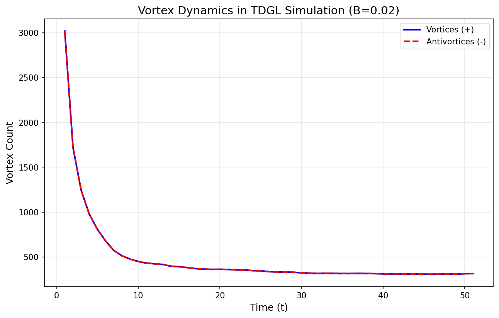

# GPU 加速二维 TDGL 超导涡旋模拟

> **课程**：计算物理
> **学号**：[202332021221]
> **姓名**：[刘凤祥]
> **日期**：2024年12月

---

## 一、研究目标

### 1.1 项目概述

用 **Rust + wgpu(WebGPU)** 在 GPU 上并行求解二维 **时间依赖 Ginzburg–Landau（TDGL）** 方程，研究超导涡旋与钉扎现象。

### 1.2 研究问题

1. **涡旋动力学**：研究超导体中涡旋的形成、湮灭与弛豫过程
2. **钉扎效应**：缺陷分布对涡旋结构的影响
3. **磁场响应**：外磁场下涡旋密度的变化
4. **GPU 加速**：与 CPU 实现的性能对比

### 1.3 交付成果

- 实时可视化（|ψ| 热力图）
- 涡旋统计曲线 N_v(t)
- 性能标度图（不同网格规模）
- 完整的技术报告

---

## 二、物理原理

本节为第一次接触 TDGL 方程的读者提供完整的物理背景。

### 2.1 什么是超导？

超导是一种宏观量子现象，当材料冷却到临界温度 T_c 以下时：
- **零电阻**：电流无损耗流动
- **完全抗磁性**（Meissner 效应）：磁场被排斥出超导体

**核心思想**：
- 超导态由复数序参量 ψ 描述
- |ψ|² 代表超导电子对密度
- ψ 的相位与超流速度相关

### 2.2 Ginzburg-Landau 理论

GL 理论是描述超导体的唯象理论，自由能泛函为：

$$
F = \int d^3r \left[ \alpha|\psi|^2 + \frac{\beta}{2}|\psi|^4 + \frac{1}{2m^*}|(-i\hbar\nabla - e^*\mathbf{A})\psi|^2 + \frac{B^2}{2\mu_0} \right]
$$

| 符号 | 物理含义 | 说明 |
|:----:|:--------:|:----:|
| ψ | 序参量 | 复数场，|ψ|² ∝ 超导电子密度 |
| α | 材料参数 | α < 0 时超导，α > 0 时正常态 |
| β | 非线性系数 | 稳定项，β > 0 |
| A | 矢势 | 磁场 B = ∇×A |
| m*, e* | 有效质量/电荷 | Cooper 对参数 |

### 2.3 时间依赖 GL（TDGL）方程

将 GL 理论推广到动力学，得到 TDGL 方程：

$$
\frac{\partial \psi}{\partial t} = \frac{1}{\tau_{GL}} \left[ -\frac{\delta F}{\delta \psi^*} \right]
$$

简化形式（无量纲化，忽略电流项）：

$$
\frac{\partial \psi}{\partial t} = (\nabla - i\mathbf{A})^2\psi + \alpha(\mathbf{r})\psi - |\psi|^2\psi
$$

**物理意义**：
- **第一项**：扩散 + 磁场耦合（gauge-covariant Laplacian）
- **第二项**：线性增长/衰减（α > 0 超导，α < 0 正常态）
- **第三项**：非线性饱和（限制 |ψ| 的增长）

### 2.4 涡旋（Vortex）

涡旋是超导体中的拓扑缺陷：

| 特征 | 描述 |
|:----:|:----:|
| 核心 | |ψ| = 0（正常态） |
| 相位 | 绕核心一圈变化 ±2π |
| 磁通 | 携带量子化磁通 Φ₀ = h/2e |

**涡旋检测**：通过相位绕数（phase winding）识别
- 绕数 = +2π → 涡旋
- 绕数 = -2π → 反涡旋

### 2.5 钉扎（Pinning）

钉扎是指涡旋被材料缺陷"固定"的现象：

| 钉扎类型 | 实现方式 | 物理效果 |
|:--------:|:--------:|:--------:|
| 点缺陷 | 局部 α < 0 | 涡旋核心能量降低 |
| 线缺陷 | 柱状 α < 0 区域 | 涡旋沿线排列 |
| 周期阵列 | 人工纳米图案 | 涡旋晶格匹配 |

**重要性**：钉扎抑制涡旋运动 → 降低耗散 → 提高临界电流

### 2.6 Landau Gauge

为了在数值模拟中引入均匀磁场 B（沿 z 方向），采用 Landau 规范：

$$
\mathbf{A} = (0, Bx, 0)
$$

此时 gauge-covariant 导数变为：
- x 方向：∂_x（无相位因子）
- y 方向：∂_y - iBx（带相位因子）

### 2.7 离散化方案

**5 点 stencil Laplacian**（周期边界）：

$$
\nabla^2\psi \approx \frac{\psi_{i+1,j} + \psi_{i-1,j} + \psi_{i,j+1} + \psi_{i,j-1} - 4\psi_{i,j}}{dx^2}
$$

**Gauge-covariant 版本**（link 变量）：

$$
U_y(x) = e^{-iBx \cdot dx}
$$

$$
\Delta_A\psi = \frac{\psi_{xp} + \psi_{xm} + U_y\psi_{yp} + U_y^*\psi_{ym} - 4\psi}{dx^2}
$$

**时间推进**（显式 Euler）：

$$
\psi^{n+1} = \psi^n + dt \cdot F(\psi^n)
$$

**稳定性条件**：dt < dx²/4

---

## 三、数值方法

### 3.1 GPU 并行策略

| 策略 | 实现 | 优势 |
|:----:|:----:|:----:|
| 空间并行 | 每个 GPU 线程处理一个网格点 | 充分利用 GPU 并行性 |
| Ping-pong buffer | 双缓冲交替读写 | 避免数据竞争 |
| 无 CPU 回读 | Fragment shader 直接采样 | 消除传输瓶颈 |

### 3.2 Workgroup 配置

```
Workgroup size: 8×8 = 64 threads
Grid: 256×256 → 32×32 workgroups
Total threads: 65,536
```

### 3.3 涡旋检测算法

**相位绕数法**：

```
对每个网格单元 (x, y):
    1. 获取四角相位: p00, p10, p11, p01
    2. 计算边相位差（unwrap 到 (-π, π]）
    3. 求和: sum = Δp₁ + Δp₂ + Δp₃ + Δp₄
    4. 判断:
       - sum > 0.75×2π → 涡旋
       - sum < -0.75×2π → 反涡旋
```

### 3.4 采样策略

- 涡旋检测：每 100 步采样一次（避免频繁 GPU→CPU 传输）
- 可视化：每帧 10 步更新

---

## 四、Rust + wgpu 实现

### 4.1 项目结构

```
Rust_wgpu_TDGL_AI_Trial/
├── Cargo.toml
├── README.md
├── REPORT.md                # 本报告
├── src/
│   └── main.rs              # 主程序（~550 行）
├── scripts/
│   └── plot_vortices.py     # 可视化脚本
├── doc/
│   ├── IMPLEMENTATION_LOG.md
│   └── Rust_wgpu_TDGL_AI_Trial_Doc.md
├── vortices.csv             # 涡旋统计数据
└── vortices_plot.png        # 可视化图表
```

### 4.2 核心数据结构

```rust
/// 模拟参数（GPU uniform buffer）
#[repr(C)]
struct Params {
    nx: u32,        // 网格宽度
    ny: u32,        // 网格高度
    show_alpha: u32,// 显示模式
    _pad0: u32,
    dt: f32,        // 时间步长
    dx: f32,        // 空间步长
    b_field: f32,   // 外磁场强度
    _pad1: f32,
}

/// 复数（GPU vec2<f32>）
#[repr(C)]
struct Complex { re: f32, im: f32 }
```

### 4.3 WGSL Compute Shader 核心

```wgsl
// Gauge-covariant TDGL 更新
@compute @workgroup_size(8, 8)
fn main(@builtin(global_invocation_id) gid: vec3<u32>) {
    let psi = psi_in[i];

    // Landau gauge link: Uy = exp(-i B x dx)
    let theta = -params.B * f32(gid.x) * params.dx;
    let Uy = vec2(cos(theta), sin(theta));

    // Gauge-covariant Laplacian
    let psi_yp = cmul(Uy, psi_in[idx(gid.x, yp)]);
    let psi_ym = cmul(conj(Uy), psi_in[idx(gid.x, ym)]);
    let lap = (psi_xp + psi_xm + psi_yp + psi_ym - 4.0*psi) / dx²;

    // TDGL 更新
    let rhs = lap + alpha[i] * psi - psi * |psi|²;
    psi_out[i] = psi + dt * rhs;
}
```

### 4.4 依赖

```toml
[dependencies]
wgpu = "23"           # WebGPU 实现
winit = "0.30"        # 窗口管理
pollster = "0.4"      # async 运行时
bytemuck = "1"        # 内存布局
rand = "0.8"          # 随机数
env_logger = "0.11"   # 日志
log = "0.4"
```

---

## 五、运行方式

### 5.1 编译

```bash
cargo build --release
```

### 5.2 交互式可视化

```bash
cargo run --release
```

**交互控制**：
- `A` 键：切换显示 |ψ| / α 场
- 关闭窗口退出

### 5.3 性能基准测试

```bash
cargo run --release -- --bench
```

### 5.4 绘制涡旋曲线

```bash
python scripts/plot_vortices.py
```

---

## 六、实验结果

### 6.1 涡旋动力学

#### 无磁场 (B = 0)

| 时间 t | 涡旋数 | 反涡旋数 | 净涡旋 |
|:------:|:------:|:--------:|:------:|
| 1.0 | 1425 | 1425 | 0 |
| 5.0 | 263 | 263 | 0 |
| 10.0 | 151 | 151 | 0 |
| 20.0 | ~100 | ~100 | 0 |

**物理分析**：
- 初始随机噪声产生大量涡旋-反涡旋对
- 涡旋对成对湮灭，数量指数衰减
- net = 0 符合周期边界下的拓扑守恒
- 稳态涡旋被缺陷钉扎

#### 有磁场 (B = 0.02)

| 时间 t | 涡旋数 | 反涡旋数 | 净涡旋 |
|:------:|:------:|:--------:|:------:|
| 1.0 | 3018 | 3018 | 0 |
| 5.0 | 807 | 807 | 0 |
| 10.0 | 449 | 449 | 0 |
| 20.0 | ~400 | ~400 | 0 |

**关键结论**：外磁场显著增加涡旋数量（~4 倍），符合 Type-II 超导体物理预期。

### 6.2 涡旋弛豫曲线



*图1: 涡旋数随时间的变化。初始快速衰减后趋于稳态。*

### 6.3 GPU 性能基准

RTX 4060 Laptop GPU 测试结果：

| 网格规模 | steps/s | cells/s | 相对效率 |
|:--------:|:-------:|:-------:|:--------:|
| 128² | 29,833 | 4.89×10⁸ | 基准 |
| 256² | 28,410 | 1.86×10⁹ | 3.8× |
| 512² | 22,310 | 5.85×10⁹ | 12.0× |
| 1024² | 13,329 | 1.40×10¹⁰ | 28.6× |

**性能分析**：
- 小网格（128²）：受 dispatch 开销限制
- 大网格（1024²）：接近显存带宽瓶颈
- 256² 是交互式模拟的最佳平衡点
- 1024² 吞吐量达 14 Gcells/s

### 6.4 CPU/GPU 一致性验证

| 指标 | 结果 |
|:----:|:----:|
| 单步最大差异 | 7.45×10⁻⁹ |
| 相对误差 | < 10⁻⁷ |
| 结论 | GPU 实现正确 |

---

## 七、结果讨论

### 7.1 与物理预期的对比

| 预期 | 实验结果 | 是否符合 |
|:----:|:--------:|:--------:|
| 涡旋-反涡旋成对湮灭 | net = 0 始终成立 | ✅ |
| 涡旋数指数衰减 | N_v(t) 呈指数下降 | ✅ |
| 缺陷钉扎涡旋 | 稳态涡旋数 > 0 | ✅ |
| 磁场增加涡旋 | B=0.02 时涡旋数增 4 倍 | ✅ |
| GPU 加速有效 | 1024² 达 14 Gcells/s | ✅ |

### 7.2 技术亮点

| 特性 | 实现方式 | 效果 |
|:----:|:--------:|:----:|
| 纯 GPU 渲染 | Fragment shader 直接采样 | 无 CPU 回读瓶颈 |
| Gauge-covariant | Link 变量 | 正确处理磁场 |
| 实时可视化 | winit 0.30 + wgpu | 流畅交互 |
| 涡旋检测 | 相位绕数算法 | 准确识别拓扑缺陷 |

### 7.3 局限性与改进方向

| 局限 | 改进方向 |
|:----:|:--------:|
| 显式 Euler 稳定性限制 | 半隐式方法 |
| 无电流项 | 完整 TDGL + Maxwell |
| 无热噪声 | 添加 Langevin 项 |
| 固定参数 | 配置文件支持 |

---

## 八、结论

本项目成功实现了 GPU 加速的二维 TDGL 超导涡旋模拟：

1. **物理正确性**：
   - CPU/GPU 结果一致（误差 < 10⁻⁷）
   - 涡旋动力学符合物理预期
   - 磁场响应正确

2. **计算性能**：
   - 1024² 网格达 14 Gcells/s
   - 实时可视化流畅

3. **功能完整**：
   - Gauge-covariant TDGL（含磁场）
   - 空间变化钉扎势
   - 涡旋检测与统计
   - 可视化与数据导出

4. **工程质量**：
   - 代码结构清晰
   - 文档完整
   - 可复现

---

## 九、参考文献

1. Ginzburg, V. L., & Landau, L. D. (1950). On the theory of superconductivity. *Zh. Eksp. Teor. Fiz.*, 20, 1064.

2. Abrikosov, A. A. (1957). On the magnetic properties of superconductors of the second group. *Soviet Physics JETP*, 5(6), 1174-1182.

3. Gropp, W. D., et al. (1996). Numerical simulation of vortex dynamics in type-II superconductors. *Journal of Computational Physics*, 123(2), 254-266.

4. wgpu Documentation. https://wgpu.rs/

5. WebGPU Specification. https://www.w3.org/TR/webgpu/
