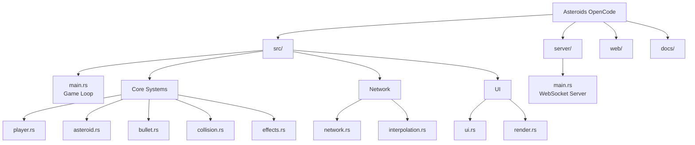

# CLAUDE.md

> **Changelog**
> - 2026-01-17: Full architecture documentation generated by initialization agent

This file provides guidance to Claude Code (claude.ai/code) when working with code in this repository.

## Project Vision

Asteroids OpenCode is a modern reimplementation of the classic Asteroids arcade game, built with Rust and the Macroquad game engine. It features multiple game modes, local and online multiplayer, roguelike progression, and advanced gameplay mechanics including client-side prediction for network play.

## Architecture Overview

**Engine**: Macroquad 0.4.14 with custom entity-component pattern (not full ECS)
**Edition**: Rust 2024
**Targets**: Native (Linux/Windows/macOS) + WASM

### Module Structure



### Module Index

| Module | Path | Purpose |
|--------|------|---------|
| **Main** | `src/main.rs` | Game loop, state machine (`GameState`/`GameMode`), collision orchestration |
| **Player** | `src/player.rs` | Player state, controls, dash, hyperspace, modifiers, Flux energy system |
| **Bullet** | `src/bullet.rs` | 5 weapon types: Normal, Spread, Penetrating, Homing, ChainIon |
| **Network** | `src/network.rs` | WebSocket client (ewebsock), message protocol, client prediction |
| **Interpolation** | `src/interpolation.rs` | `InterpBuffer<T>`, entity interpolation for network play |
| **Constants** | `src/constants.rs` | All tuning values - gameplay, timing, UI, particles |
| **Roguelike** | `src/roguelike.rs` | Run-based progression: zones, waves, rewards, boss fights |
| **Battle Draft** | `src/battle_draft.rs` | Card selection system (12 cards, 4 categories, rarity tiers) |
| **Game State** | `src/game_state.rs` | State machine enums, settings, mode definitions |
| **Server** | `server/src/main.rs` | Tokio-based WebSocket game server with room management |

### Core Game Loop

```
Input -> Physics Update -> QuadTree Collision -> Response/Scoring -> Effects -> UI -> Render
```

### Key Patterns

- **Constants centralization**: All game tuning in `src/constants.rs` organized by subsystem
- **State enums**: `GameState` (Menu/Playing/Paused/GameOver) + `GameMode` (Survival/TimeAttack/Duel/Roguelike/Online)
- **QuadTree collision**: O(log n) spatial partitioning in `quadtree.rs`
- **Client prediction**: Local input prediction with server reconciliation (`reconcile()`, `reset_prediction_state()`)

## Build and Development Commands

```bash
# Development
cargo build                    # Debug build
cargo run                      # Run debug build
cargo check                    # Quick compile check (use this frequently)

# Production
cargo build --release          # Optimized build (opt-level='z', LTO enabled)
cargo run --release            # Run release build

# Quality
cargo test                     # Run unit tests (in-module tests)
cargo fmt                      # Format code (2024 edition)
cargo clippy -- -D warnings    # Strict linting

# Profiling (native only)
cargo run --release --features profiling  # Enable puffin profiler

# CLI testing flags
cargo run -- --frames 1000                   # Run N frames then exit
cargo run -- --dump-metrics metrics.json     # Export performance metrics
cargo run -- --entities 500                  # Stress test with N entities
cargo run -- --network-test                  # Enable network test mode
cargo run -- --headless                      # CI mode (no graphics)
```

### Server (in `server/` directory)

```bash
cd server
cargo build --release
cargo run --release
```

### Web/WASM Build

```bash
./build_web.sh    # Outputs to web/
```

## Game Modes

| Mode | Description | Players |
|------|-------------|---------|
| **Survival** | Clear asteroid waves cooperatively | 1-2 |
| **TimeAttack** | Score as much as possible within time limit | 1-2 |
| **Duel** | Competitive flag-capture battles | 2 |
| **Roguelike** | Run-based progression with zones and bosses | 1 |
| **Online** | WebSocket multiplayer (WIP) | 2+ |

## Network Architecture (Online Mode)

```
Client -> Server: JoinQueue, GameInput, Ready, LeaveRoom, Ping
Server -> Client: Connected, MatchFound, GameState, GameOver, Pong
```

- JSON serialization via serde
- 100ms render delay for interpolation
- Client-side prediction with server reconciliation
- Rate limiting: 10 msg/sec, 50 msg/min

Network sync phases roadmap in `docs/PHASE_ROADMAP.md`:
- Phase 1-3: Complete (prediction, interpolation, multi-entity sync)
- Phase 4-8: In progress (lag compensation, reconnection, server authority)

## Key Constants Reference

Important tuning values in `src/constants.rs`:

```rust
// Gameplay
gameplay::INITIAL_ASTEROID_COUNT = 10
gameplay::ASTEROID_WAVE_INCREMENT = 2

// Phase Dash
phase_dash::DISTANCE = 150.0     // Teleport distance
phase_dash::COOLDOWN = 3.0       // Seconds
phase_dash::EXPLOSION_RADIUS = 70.0

// Chain Ion
chain_ion::MAX_JUMPS = 2
chain_ion::RANGE = 260.0
chain_ion::DAMAGE_RATIOS = [1.0, 0.7, 0.5]

// Homing Missiles
homing::SPEED = 900.0
homing::TURN_RATE = 4.0
homing::TRACKING_RANGE = 500.0

// Flux Energy System
flux::MAX = 100.0
flux::REGEN_PER_SEC = 8.0
flux::DASH_COST = 20.0
flux::PHASE_DASH_COST = 40.0
```

## Test Strategy

- **Unit tests**: In-module `#[cfg(test)]` blocks for each module
- **Integration**: CLI flags (`--frames`, `--headless`) for CI testing
- **Performance**: `--dump-metrics` exports JSON performance data
- **Network**: Server integration via WebSocket testing

Run all tests:
```bash
cargo test
```

## Coding Conventions

- Rust 2024 edition features
- Centralized constants in `src/constants.rs`
- Module-level documentation with `//!` comments
- Snake_case for functions/variables, PascalCase for types
- Prefer `#[allow(dead_code)]` over removing work-in-progress code

## Debug Features

- **F3**: Toggle debug panel (FPS, entity count, quadtree depth)
- `--dump-metrics`: Export JSON performance data
- `profiling` feature: Enable puffin HTTP server for flame graphs

## AI Usage Guidelines

When modifying this codebase:

1. **Constants**: Always check `src/constants.rs` before hardcoding values
2. **State Machine**: New game states go in `src/game_state.rs`
3. **Network Protocol**: Keep client/server message types in sync
4. **Tests**: Add tests for new Player/Bullet/Network functionality
5. **WASM**: Test changes on both native and `--target wasm32-unknown-unknown`

## Documentation

- `docs/PHASE_ROADMAP.md` - Network sync phases 1-8 roadmap
- `docs/adr/` - Architecture Decision Records (ECS choice, network protocol)
- `docs/perf.md` - Performance monitoring guide
- `README.md` - User-facing documentation and controls

## Related Files
                                    
| File | Purpose |
|------|---------|
| `Cargo.toml` | Dependencies and build config |
| `achievements.json` | Achievement definitions |
| `build_web.sh` | WASM build script |
| `server/Cargo.toml` | Server dependencies |
