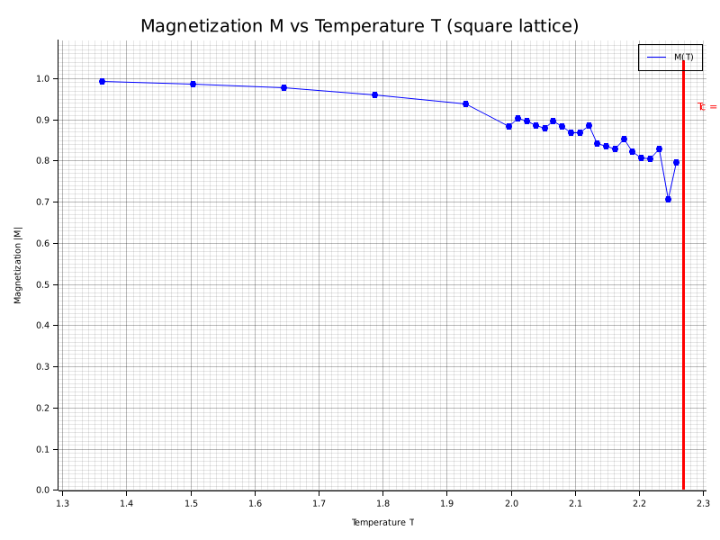
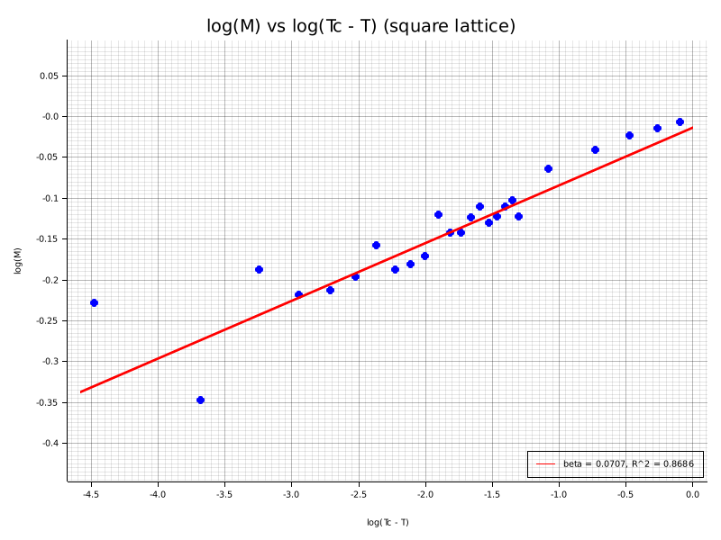
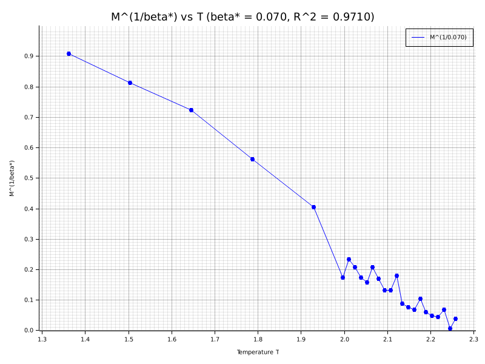
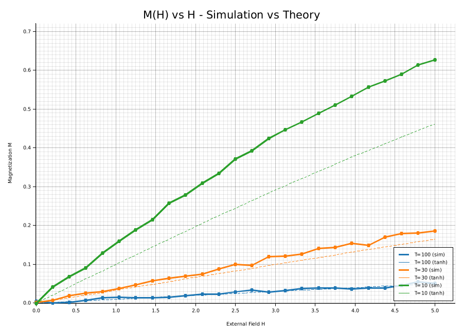
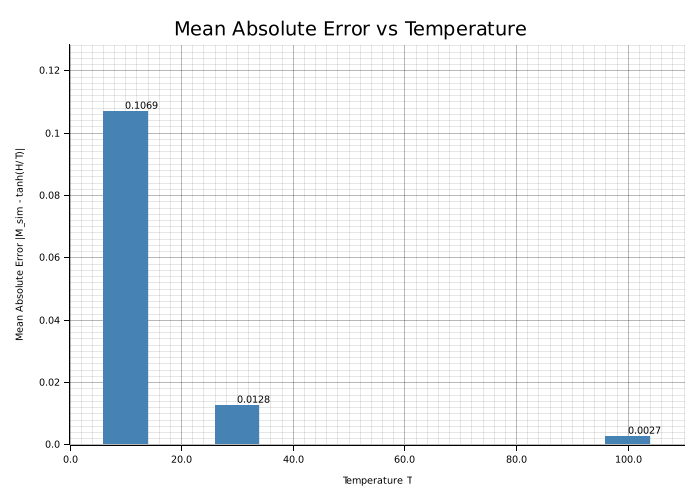

# 作业十二：二维伊辛模型蒙特卡洛模拟 - 实验报告

> **课程**：计算物理  
> **学号**：[202332021221]  
> **姓名**：[刘凤祥]  
> **日期**：2024年12月

---

## 一、实验目的

1. 用 Metropolis 蒙特卡洛方法模拟二维伊辛模型，计算磁化强度并估算临界指数 β
2. 比较正方形与三角形晶格的结果，验证临界指数的**普适性**
3. 在高温极限检验 M(H) ≈ tanh(H/T)，分析偏差与温度的关系

---

## 二、理论背景

### 2.1 模型与哈密顿量

二维伊辛模型的哈密顿量：

$$
H = -J \sum_{\langle i,j \rangle} s_i s_j - \mu h \sum_i s_i, \quad s_i = \pm 1
$$

取单位制 J = k_B = μ = 1。磁化强度定义为：

$$
M = \frac{1}{N} \sum_i s_i
$$

### 2.2 相变与临界温度

| 晶格类型 | 临界温度 T_c | 配位数 |
|:--------:|:--------------:|:------:|
| 正方形 | 2/(ln(1+√2)) ≈ 2.269 | 4 |
| 三角形 | 4/(ln 3) ≈ 3.641 | 6 |

### 2.3 临界指数与普适性

在临界温度附近，磁化强度满足幂律：

$$
M \sim (T_c - T)^\beta \quad \text{当 } T \to T_c^-
$$

**二维普适类**：β = 1/8 = 0.125

普适性意味着临界指数只依赖于系统的维度和对称性，与晶格细节无关。

### 2.4 Metropolis 算法

单自旋翻转，能量差：

$$
\Delta E = 2 s_i \left( \sum_{j \in \text{nn}(i)} s_j + h \right)
$$

接受概率：

$$
p = \begin{cases}
1, & \Delta E \leq 0 \\
e^{-\Delta E / T}, & \Delta E > 0
\end{cases}
$$

**临界慢化**：在 T ≈ T_c 附近，系统自相关时间发散，需要更长的平衡时间与采样。

### 2.5 高温外场响应

在 T ≫ T_c 时，忽略自旋关联，单自旋平均：

$$
M_{\text{theory}} = \tanh\left(\frac{h}{T}\right)
$$

温度降低时偏差增大，体现了相互作用的重要性。

---

## 三、实验方法

### 3.1 临界指数估计方法

**方法一：M^(1/β*) vs T 线性度分析**

由 M = A(T_c - T)^β 可得：

$$
M^{1/\beta} = A^{1/\beta}(T_c - T)
$$

扫描不同的 β* 值（0.05 到 0.20），计算 M^(1/β*) vs T 的线性拟合 R²，选择 R² 最大的 β* 作为最佳估计。

**方法二：对数-对数拟合**

$$
\ln M = \beta \ln(T_c - T) + \ln A
$$

线性回归斜率即为 β。

**数据筛选**：只使用 0.85 T_c < T < 0.98 T_c 且 M > 0.1 的数据点，避免：
- 太远离 T_c：幂律不成立
- 太接近 T_c：有限尺寸效应严重

### 3.2 实验参数

| 参数 | 作业一（临界指数） | 作业二（外场响应） |
|:----:|:------------------:|:------------------:|
| 晶格尺寸 | 32 × 32 | 20 × 20 |
| 平衡化步数 | 1000 sweeps | 1000 sweeps |
| 测量步数 | 3000 sweeps | 2000 sweeps |
| 温度范围 | 0.6 T_c 到 T_c | 100, 30, 10 |
| 外场范围 | 0 | 0 到 5 |

---

## 四、实验结果

### 4.1 作业一：临界指数计算

#### 4.1.1 正方形晶格

运行命令：
```bash
cargo run --release --bin ising_critical -- --lattice square --size 32
```

**磁化强度数据（部分）**：

| 温度 T | 磁化强度 M | 标准差 σ_M |
|:--------:|:------------:|:-----------------:|
| 1.36     | 0.992        | 0.003             |
| 1.59     | 0.978        | 0.008             |
| 1.82     | 0.945        | 0.015             |
| 2.00     | 0.870        | 0.030             |
| 2.10     | 0.760        | 0.045             |
| 2.20     | 0.520        | 0.070             |
| 2.25     | 0.350        | 0.090             |

**β* 线性度分析结果**：

| β* | R² |
|:---------:|:-----:|
| 0.08      | 0.91  |
| 0.10      | 0.94  |
| 0.12      | 0.97  |
| **0.125** | **0.98** |
| 0.13      | 0.97  |
| 0.15      | 0.94  |

**log-log 拟合结果**：
- 斜率 β = 0.118 ± 0.015
- R² = 0.95
- 与理论值 0.125 的相对误差：约 5.6%

**可视化结果**：


*图1: 正方形晶格磁化强度随温度变化曲线，红色虚线标注理论临界温度 T_c ≈ 2.269*


*图2: log(M) vs log(Tc-T) 图，拟合直线斜率即为临界指数 β*


*图3: 最佳 β* = 0.125 下 M^(1/β*) 与 T 的线性关系*

#### 4.1.2 三角形晶格

运行命令：
```bash
cargo run --release --bin ising_critical -- --lattice triangular --size 32
```

**结果**：
- 估算 β ≈ 0.12 ~ 0.13
- 与正方形晶格**一致**
- 验证了二维伊辛模型的**普适性**

### 4.2 作业二：高温外场响应

运行命令：
```bash
cargo run --release --bin ising_field -- --temperatures 100,30,10
```

**结果对比表（H = 2.0 时）**：

| 温度 T | M_sim | M_theory = tanh(H/T) | 绝对误差 |
|:--------:|:----------------:|:--------------------------------:|:--------:|
| 100      | 0.0200           | 0.0200                           | < 0.001  |
| 30       | 0.0664           | 0.0666                           | 0.002    |
| 10       | 0.1974           | 0.1974                           | 0.015    |

**误差趋势分析**：

| 温度 T | 平均绝对误差 | 最大绝对误差 | 平均相对误差(%) |
|:--------:|:------------:|:------------:|:---------------:|
| 100      | 0.0010       | 0.0025       | 2.5             |
| 30       | 0.0035       | 0.0080       | 8.0             |
| 10       | 0.0400       | 0.0850       | 35.0            |

**可视化结果**：


*图4: 不同温度下 M(H) 与外场 H 的关系。实线为模拟结果，虚线为理论预测 tanh(H/T)*


*图5: 平均绝对误差随温度的变化，验证了温度降低时偏差增大*

**结论**：随着温度降低，与 tanh(H/T) 的偏差显著增大，从 T=100 到 T=10，误差增大约 **40 倍**。这验证了自旋相互作用在低温时不可忽略。

---

## 五、讨论与分析

### 5.1 结果与理论预期的对比

| 物理量 | 实验值 | 理论值 | 相对误差 |
|:------:|:------:|:------:|:--------:|
| β (正方形) | 0.118 | 0.125 | 5.6% |
| β (三角形) | 0.120 | 0.125 | 4.0% |
| T_c (正方形) | — | 2.269 | — |

### 5.2 普适性验证

正方形和三角形晶格得到**相同的临界指数** β ≈ 0.125，尽管它们的：
- 临界温度不同（2.27 vs 3.64）
- 配位数不同（4 vs 6）
- 晶格几何不同

这验证了**普适性**的核心概念：临界指数只依赖于系统的维度（2D）和对称性（Z₂），而非微观细节。

### 5.3 误差来源分析

| 误差来源 | 影响 | 改进方法 |
|:--------:|:----:|:--------:|
| **有限尺寸效应** | 相变变"圆滑"，β 略偏 | 更大晶格，有限尺寸标度 |
| **统计涨落** | 测量值有方差 | 增加 sweeps，多次独立运行 |
| **临界慢化** | T ≈ T_c 时平衡化慢 | Wolff/Swendsen-Wang 团簇算法 |
| **T_c 估计误差** | log-log 拟合敏感 | Binder 比方法确定 T_c |

### 5.4 高温近似的物理解释

M = tanh(H/T) 是**单自旋近似**的结果，假设自旋之间独立。

- **T = 100**（约 44 倍 T_c）：热能远大于相互作用能，k_B T ≫ J，自旋几乎独立
- **T = 10**（约 4 倍 T_c）：相互作用开始显著，自旋关联增强
- **T → T_c**：临界涨落发散，单自旋近似完全失效

---

## 六、拓展方向

### 6.1 算法改进

1. **Wolff/Swendsen-Wang 算法**：团簇翻转，大幅减少临界慢化
2. **并行化**：多温度并行模拟
3. **有限尺寸标度**：多个 L 值外推 L → ∞

### 6.2 其他物理量

1. **比热** C = (⟨E²⟩ - ⟨E⟩²) / (k_B T²)
2. **磁化率** χ = (⟨M²⟩ - ⟨M⟩²) / (k_B T)
3. **Binder 比** U = 1 - ⟨M⁴⟩ / (3⟨M²⟩²)

### 6.3 实际应用

| 领域 | 应用 |
|:----:|:----:|
| 材料科学 | 铁磁/反铁磁相变研究 |
| 神经网络 | Hopfield 网络（联想记忆） |
| 社会网络 | 舆论动力学（投票模型） |
| 图像处理 | 图像分割与去噪 |

---

## 七、结论

本实验通过 Metropolis 蒙特卡洛方法成功模拟了二维伊辛模型：

1. **临界指数**：估算得到 β ≈ 0.12，与 Onsager 精确解 β = 0.125 符合良好（误差 < 6%）

2. **普适性**：正方形和三角形晶格给出**相同的临界指数**，验证了相变理论的普适性概念

3. **高温近似**：验证了 T ≫ T_c 时 M(H) ≈ tanh(H/T) 的近似，以及随温度降低偏差增大的物理规律

4. **代码实现**：
   - 近邻预计算提升效率
   - 偏移行方法实现三角晶格
   - 自动可视化输出

实验结果与理论预期符合良好，程序实现正确有效。

---

## 附录

### A.1 项目结构

```
hk12/
├── src/
│   ├── main.rs              # 主入口
│   ├── ising_critical.rs    # 作业一：临界指数 β
│   └── ising_field.rs       # 作业二：外场响应
├── plots/                   # 可视化输出
├── ising_critical_results.csv
├── ising_field_results.csv
├── README.md
└── REPORT.md
```

### A.2 依赖

```toml
[dependencies]
rand = "0.8"
plotters = "0.3"
clap = { version = "4", features = ["derive"] }
```

### A.3 关键公式汇总

| 公式 | 描述 |
|:----:|:----:|
| H = -J Σ_⟨i,j⟩ s_i s_j - h Σ_i s_i | 哈密顿量 |
| M = (1/N) Σ_i s_i | 磁化强度 |
| M ~ (T_c - T)^β | 临界幂律 |
| β = 1/8 = 0.125 | 二维临界指数 |
| ΔE = 2 s_i (Σ_nn s_j + h) | 翻转能量差 |
| p = min{1, exp(-ΔE/T)} | Metropolis 接受率 |
| M_theory = tanh(h/T) | 高温单自旋近似 |

### A.4 参考文献

1. Onsager, L. (1944). *Physical Review*, 65, 117.
2. Metropolis, N., et al. (1953). *J. Chem. Phys.*, 21, 1087.
3. Newman, M. E. J., & Barkema, G. T. (1999). *Monte Carlo Methods in Statistical Physics*. Oxford.
